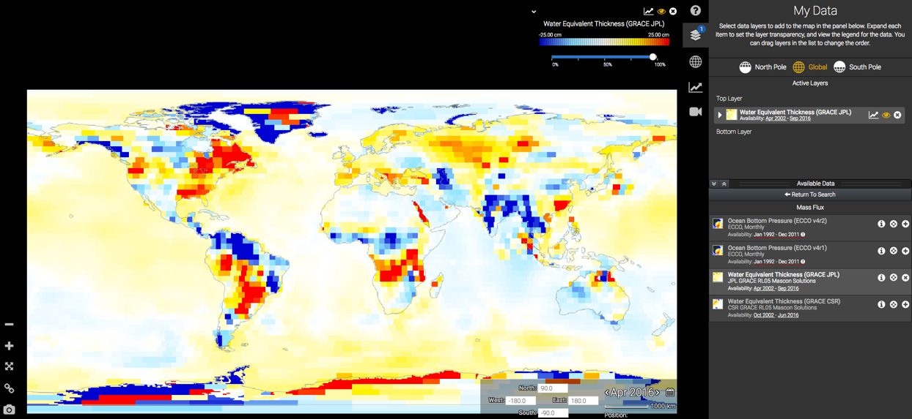
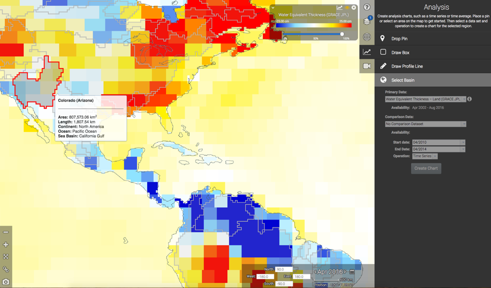
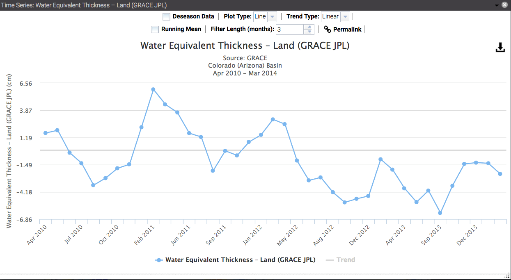
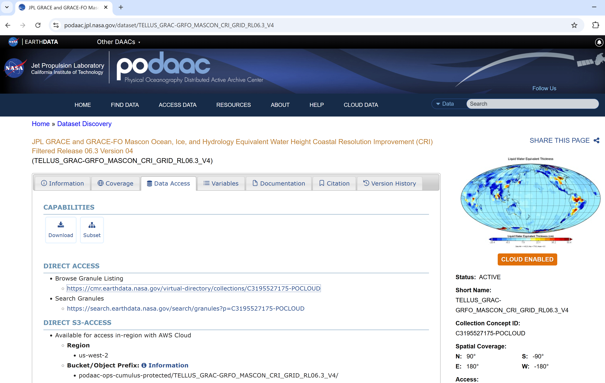
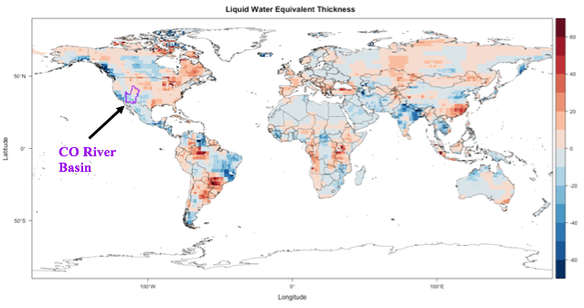
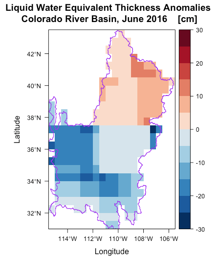

############################################################################################
Appendix A: Water Storage Anomalies over the Colorado River Basin
############################################################################################

See the related jupyter notebook : :doc:`../tutorials_as_jupyter_notebooks/Tellus_GRACE_TWS_basin_mean`

Click here to open the notebook in Binder 

.. image:: https://mybinder.org/badge_logo.svg
 :target: https://mybinder.org/v2/gh/msikka09/GRACE-FO_L3_Handbook/main?urlpath=%2Fdoc%2Ftree%2Fsource%2Ftutorials_as_jupyter_notebooks%2FTellus_GRACE_TWS_basin_mean.ipynb

**Step 1**

a).	Launch the interactive web application to explore GRACE anomalies located at https://grace.jpl.nasa.gov/data/data-analysis-tool/  

b).	Look at the water equivalent thickness (GRACE JPL) mascon solutions globally (Figure 1A). 

c).	Change the date of the data shown to see the changes in monthly water equivalent thickness anomalies. 

Figure 1A. Display of the interactive web application to explore GRACE data.

d). Pick a basin of interest to look at the “Analysis” output. Hover the mouse over the basin of choice and zoom in toward this location. Information on the basin area, length, continent, ocean and sea basin will appear in a pop-up box (Figure 1B). 

Figure 1B. Display of the interactive web application zoomed-in to the Colorado River Basin, showing information on the basin area, length, continent, ocean and sea basin in a pop-up box.

e).	Create a time series chart by specifying a start date and end date then clicking the “Create Chart” button (Figure 1C)

Figure 1C. Display of the interactive web application chart of Water Equivalent Thickness anomalies over the Colorado River Basin.

**Step 2**

f).	Download Level-3 gridded mascon Terrestrial Water Storage anomalies data from GRACE Tellus via PODAAC (https://podaac.jpl.nasa.gov/dataset/TELLUS_GRAC-GRFO_MASCON_CRI_GRID_RL06.3_V4). We will use the Mascon dataset with the Coastline Resolution Improvement (CRI) filter (Figure 1D).

Figure 1D. Level-3 global mass concentration Terrestrial Water Storage anomalies derived from GRACE and GRACE-FO. This use case requires the gain factor netCDF file as well as the Coastline Resolution Improvement (CRI) filter netCDF file (highlighted by the red box). 

g). Mascon file also contains scale factors (the requisite gain factor information) required to read and process the Tellus Mascon Earth Science Data Record (ESDR).

h).	Download the boundary shapefile for the CO River Basin

**Step 3**

i).	Produce a map showing the raw Level-3 CRI-filtered Liquid Water Equivalent Thickness anomalies with world countries outlined and the CO River Basin highlighted (Figure 1E). 
   
   i). 	NOTE: If your application requires a different baseline (e.g., instead of 2004-2009 you need 2005-2010), you can simply compute that by averaging each grid point over the 2005-2010 baseline, and subtract that value from all time steps.

Figure 1E. Map of the raw Level-3 CRI-filtered Liquid Water Equivalent Thickness anomalies with world countries outlined and the CO River Basin highlighted.

j).	Multiply the GRACE Level-3 Mascon raster by gain factor raster. 
   
   i).	Due to the sampling and post-processing of GRACE observations, surface mass variations at small spatial scales tend to be attenuated. Therefore, users have the option to multiply GRACE Tellus Land data by the provided gridded gain factors. 
   
   ii).	The scaling grid is a set of scaling coefficients, one for each 1 degree bin of the land grids, and are intended to restore much of the signal amplitude removed by the destriping, Gaussian, and degree 60 filters applied to the land grids. To use these scaling coefficients, the time series at one grid (1 degree bin) location must be multiplied by the scaling factor at the same 1 degree bin position.

k).	Subset the GRACE Mascon data to include only the CO River Basin. 

l).	Compare the difference in the data of the original raw data to the data corrected with the gain factors (Figure 1F).

.. list-table::
   :widths: 50 50
   :align: center

   * - .. image:: ../figures/fig1f_basin_map_no_scalefactor.png
          :width: 300px
     - .. image:: ../figures/fig1f_basin_map_with_scalefactor.png
          :width: 300px

Figure 1F. GRACE Mascon water storage anomalies for June, 2016 with no gridded gain factors applied (left) and multiplied by the gridded gain factors (right).

**Step 4**

m).	Plot the final map of GRACE Mascon water storage anomalies for June, 2016. 

n).	Then, create the time series plot showing LWE Thickness Anomalies averaged over the CO River Basin (Figure 1G).

.. figure:: ../figures/fig1gb_colorado_basin_timeseries.png
    :align: center
    :alt: alternate text
    :figclass: align-center

Figure 1G. GRACE Mascon Liquid Water Equivalent anomalies for June, 2016 in the CO River Basin with gain factor applied and values spatially disaggregated (top) and a time series plot showing Liquid Water Equivalent anomalies averaged over the CO River Basin.
