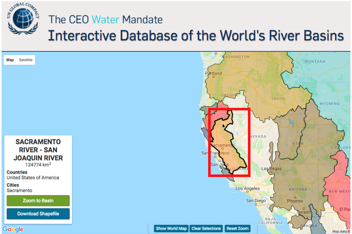
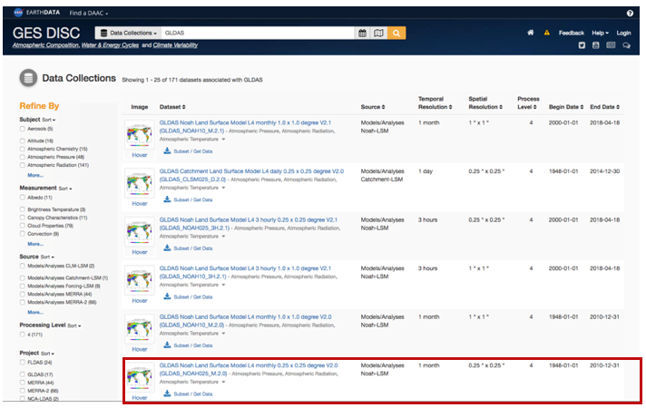
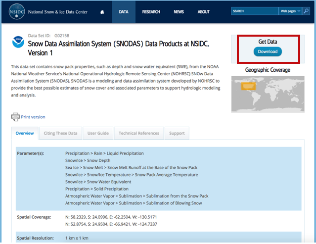
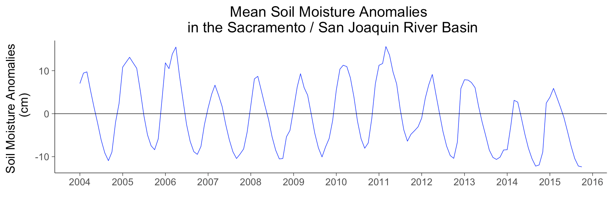
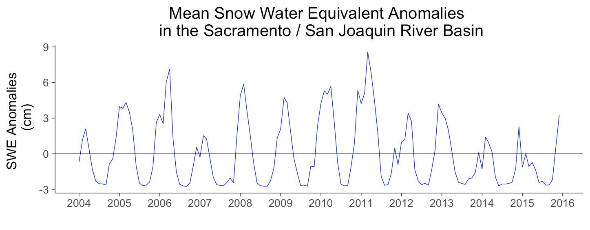
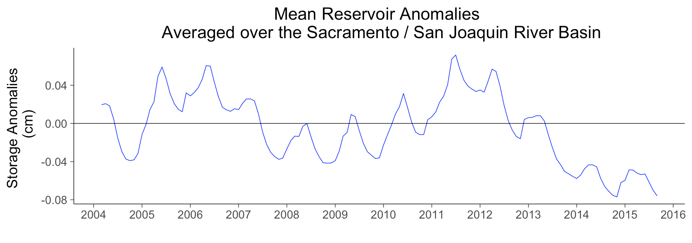
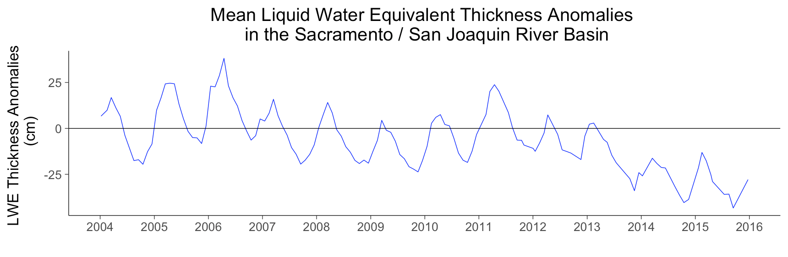
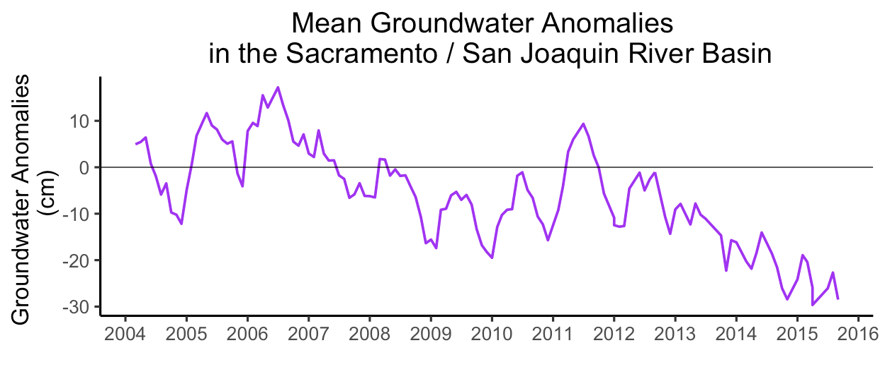

###########################################################################################
Appendix B: Groundwater Storage Anomalies in the Sacramento / San Joaquin river basin
###########################################################################################

**Step 1**

a).   Download Level-3 gridded Coastal Resolution Improvement (CRI) filtered Mascon Terrestrial Water Storage anomalies data from GRACE Tellus (please see Water Storage Anomalies in the Colorado River Basin use case in Appendix A for details)

b).   Download the boundary of the Sacramento / San Joaquin basin from Interactive Database of the World’s River Basins at http://riverbasins.wateractionhub.org/ (Figure 2A).

Figure 2A. The Sacramento / San Joaquin basin from Interactive Database of the World’s River Basins is highlighted in red and can be downloaded as a shapefile on the lower left part of the screen.  

c).	Download Soil moisture from Global Land Data Assimilation System (GLDAS) at https://disc.sci.gsfc.nasa.gov/datasets?keywords=GLDAS. This example uses data from the NOAH monthly 0.125 degree resolution product (NLDAS_NOAH0125_M.002) (Figure 2B). 

Figure 2B. The Soil moisture from Global Land Data Assimilation System (GLDAS) is highlighted in red and can be subset and downloaded in multiple raster formats.  

d).	Download snow water equivalent (SWE) data from SNODAS website at https://nsidc.org/data/g02158 (Figure 2C). 

Figure 2C. The place to download Snow Water Equivalent from the SNOw Data Assimilation System (SNODAS) is highlighted in red and can be subset and downloaded in multiple raster formats.  

e).	Download all of the monthly reservoir level data for the time period of interest (2004 – 2015) from California Data Exchange Center (CDEC) at https://cdec.water.ca.gov (Figure 2D). 

f).	Subset the stations with latitude and longitude coordinates that fall into the study area boundary. 

Figure 2D. The California Data Exchange Center (CDEC) hosts the Reservoir level data used for this use case.

**Step 2**

g). Convert tabular reservoir storage anomaly data to raster data and conduct the unit conversions.

   i).	Convert the tabular data to point data using the latitude and longitude information from each reservoir measurement station. 
   
   ii).	Create a raster from each reservoir station point. The spatial resolution of the resulting raster pixels should equal the spatial resolution of the GRACE data (0.5 degrees). 
   
   iii). We need to end up with all input data using the same units of measurement. In this example, we choose to use cm to match GRACE LWE thickness units. 

      1. First, convert acre-feet to km3 by multiplying each cell in the raster by 0.000001233.
      2. To account for the area of the pixel, (which is 0.5 degrees x 0.5 degrees = ~55.5km x 55.5km), divide each raster cell by (55.5km)2 = 3080.25 km2
      3. Multiply the raster by 100,000 to convert the height in kilometers to centimeters. 

h).	Conduct the unit conversions for soil moisture and snow water equivalent.

   i.	For soil moisture, we need to convert the original units of [kg/m2] to [cm]. 

      1. 	1 [kg] of water at Standard Temperature and Pressure = 1 [liter] = 1000 [cm3].
      2. 	1 [m2] = 10,000 [cm2]. 
      3.	Therefore, 1 [kg/m2] of water = 1 [mm] = 0.1 [cm].

   ii.	For snow water equivalent, the original units are in millimeters. To convert to centimeters, multiply by 0.1:

      1. SWE  [cm] = SWE [mm] * 0.1 [cm/mm] 

i).	Subset the data that corresponds to the study area of the Sacramento / San Joaquin basin. 

j).	All of the ancillary data sets needed to derive groundwater estimates will have to be anomalies with the same baseline as the GRACE data. To do this, we compute the mean between Jan. 2004 and Dec. 2009 for all variables of interest. Then, subtract that baseline from all monthly observations. 

For simplicity, we use the original 2004-2009 baseline and subtract it from the ancillary data, keeping in mind that the selection of another baseline will also work. 

k).	Create a set of anomalies maps for an example time period (we use Sep. 2015) for the variables of interest: Soil Moisture, Snow Water Equivalent, Reservoir storage and GRACE Equivalent Water Thickness anomalies (Figure 2E):

.. list-table::
   :widths: 50 50
   :align: center

   * - .. image:: ../figures/fig2e_map_soil_moisture.png
          :width: 300px
     - .. image:: ../figures/fig2e_map_swe.png
          :width: 300px
   * - .. image:: ../figures/fig2e_map_storageanomaly.png
          :width: 300px
     - .. image:: ../figures/fig2e_maplwe.png
          :width: 300px

Figure 2E. Maps of the September 2015 anomalies for the variables of interest: Soil Moisture (top left), Snow Water Equivalent (top right), Reservoir storage (bottom left) and GRACE Equivalent Water Thickness anomalies (bottom right).

l).	Aggregate the Soil Moisture and Snow Water Equivalent anomalies to match the more coarse 0.5 degree spatial resolution of the GRACE Mascon data. 
m).	Derive groundwater storage anomalies by subtracting Soil Moisture, Snow Water Equivalent, and reservoir storage anomalies from the GRACE Mascon Equivalent Water Thickness anomalies. 
n).	Create a time series of the input variables and of the final groundwater anomalies from 2004-2015 averaged over the Sacramento / San Joaquin basin (Figure 2F).

    

Figure 2F. Mean time series from 2004 to 2016 averaged over the Sacramento / San Joaquin basin for: Soil Moisture (top), Snow Water Equivalent (second from top), Reservoir storage (third from top), GRACE Equivalent Water Thickness anomalies (fourth from top), and ground water anomalies (bottom).
