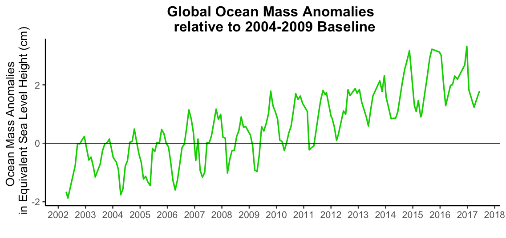
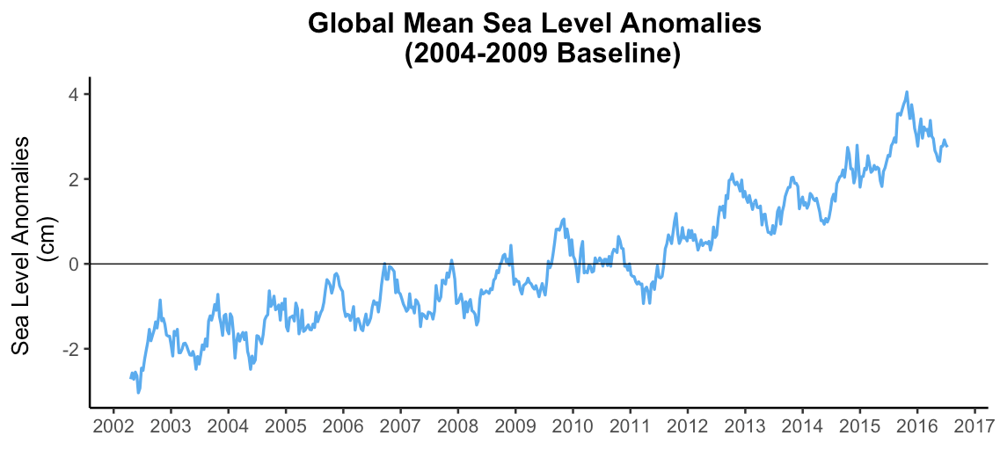
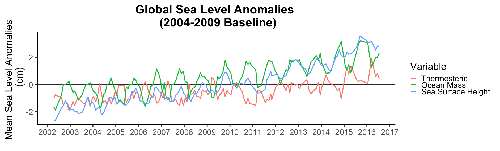

############################################################################################
Appendix C: Ocean Mass and Sea Level Budget
############################################################################################

**Step 1**

a).	Download the Level-3 gridded Mascon Terrestrial Water Storage anomalies data from PODAAC website.

b).	Land mask is available in the same mascon file

c).	Non-tidal variability is corrected for by using the time variable background model known as Atmosphere and Ocean De-aliasing Level-1B (AOD1B) (see section 3.3.6). The AOD1B product contains four different sets of Stokes coefficients characterizing the disturbing potential caused by anomalous masses in atmosphere and ocean. In this example, we will use 'GAD', which is the monthly average of 'oba' coefficients representing ocean bottom pressure simulated forced by atmospheric surface pressure and other meteorological quantities from the lower boundary of the atmosphere. In this application, only the global ocean mean of GAD is required, which is provided in TN12 at https://podaac.jpl.nasa.gov/gravity/gracefo-documentation. 

d).	Download GIA-corrected Global Mean Sea Level (GMSL) time series data from sealevel.nasa.gov/ or directly access GMSL time series, called GMSL_TPJAOS_4.2_199209_201801.txt,  here: ftp://podaac.jpl.nasa.gov/allData/merged_alt/L2/TP_J1_OSTM/global_mean_sea_level/). 

   i).	Note that the Global Mean Sea Level (GMSL) data were produced by Brian Beckley from SGT, Inc. at NASA Goddard Space Flight Center and funded by NASA MEaSUREs. The GMSL was generated using the Integrated Multi-Mission Ocean Altimeter Data for Climate Research (http://podaac.jpl.nasa.gov/dataset/MERGED_TP_J1_OSTM_OST_ALL_V2)

   ii). It combines Sea Surface Heights from TOPEX/Poseidon, Jason-1 and OSTM/Jason-2 with all biases and corrections applied and placed onto a georeferenced orbit. This creates a consistent data record throughout time, regardless of the instrument used. 

   iii). If you use these data in a publication, please cite: B. D. Beckley, N. P. Zelensky, S. A. Holmes, F. G. Lemoine, R. D. Ray, G. T. Mitchum, S. D. Desai & S. T. Brown, Assessment of the Jason-2 Extension to the TOPEX/Poseidon, Jason-1 Sea-Surface Height Time Series for Global Mean Sea Level Monitoring, Marine Geodesy, Vol 33, Suppl 1, 2010. DOI:10.1080/01490419.2010.491029.

**Step 2**

e). Apply Land mask to isolate the ocean in GRACE mascons.

f).	Compute the global mean of each GRACE mascon observation and save the resulting time series as a table. 

g).	Remove the effect of atmospheric pressure by subtracting the GAD background model from the global mean GRACE mascons time series.

h).	Obtain ocean mass anomalies by adjusting for the difference in ocean density versus freshwater density:

   i). Fresh water density is about 997 kg/m³. Meanwhile, density of ocean water at the sea surface is about 1027 kg/m³. There are two main factors that make ocean water more or less dense than about 1027 kg/m³: the temperature of the water and the salinity of the water. Ocean water gets more dense as temperature goes down. Higher ocean salinity also makes the water more dense.  
  
   ii). In order to keep this use case simple, we will derive an estimate of ocean mass anomalies by multiplying the GAD-adjusted GRACE mass anomalies time series by a single constant of 1.03.

i).	Plot the ocean mass anomalies data over time (Figure 3A).
 

Figure 3A. Global ocean mass  anomalies in equivalent sea level height from 2002 – 2016. 

**Step 3**

j).	Derive global sea level anomalies with a baseline to match the baseline of GRACE mascon data (Jan. 1, 2004 – Dec. 31, 2009)

   i). Subset the GIA-corrected global sea level altimetry data from Jan. 1, 2004 – Dec. 31, 2009. 

   ii).	Compute the mean value of the 2004 – 2009 subset of data. 

   iii).	Subtract the 2004 –2009 mean sea level value from each observation in the time series.

   iv).	Convert the units from mm to cm by multiplying each observation by 0.1.

k).	Plot the sea level anomalies derived from the previous step (Figure 3B). 

Figure 3B. Global mean sea level anomalies data from 2002 – 2016.
  
l). Derive the component of the sea level budget that can be attributed to thermal expansion by subtracting the ocean mass anomalies time series from the global mean sea level anomalies time series. 

m). Produce a graph containing all three components: ocean height change attributed to thermal expansion, ocean mass anomalies and sea level anomalies from 2002-2016 (Figure 3C).  

Figure 3C. Component of ocean height change attributed to thermal expansion (Thermosteric) plotted with ocean mass anomalies and sea level anomalies from 2002-2016