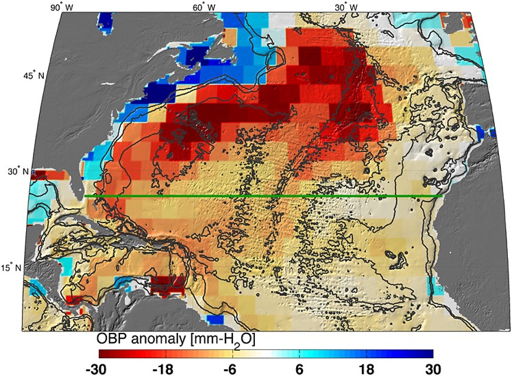
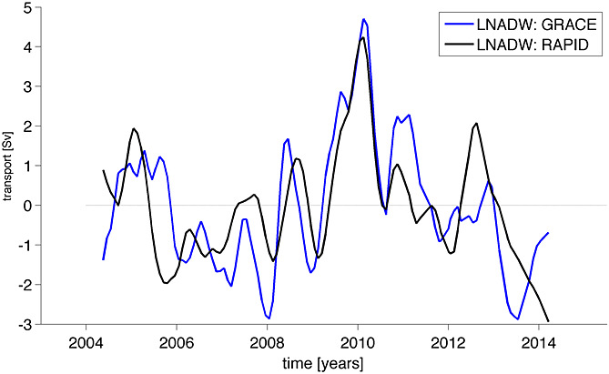

############################################################################################
Appendix D: Ocean Currents and Transport
############################################################################################

NOTE: This use case does not go as in-depth as the others. For more information on how to replicate the steps highlighted below, please refer to Landerer et a. (2015).

Background information:
================================

The Atlantic Meridional Overturning Circulation (AMOC) consists of a northward flow in the upper layer of the ocean mostly between the surface and 1000 m depth and a return flow of North Atlantic Deep Water to the south in the deeper layers between 1000 and 5000 m. AMOC plays a key role in the poleward transport of heat. Changes in this transport can influence climate at higher latitudes significantly, with potentially significant impacts for the Northern Hemisphere (Intergovernmental Panel on Climate Change (IPCC), 2013). 

Landerer et al. (2015) present the first measurements of Lower North Atlantic Deep Water transport changes using OBP estimates derived from GRACE. Large‐scale AMOC flows are generally in geostrophic balance, and the meridional transport at a particular latitude and depth can be derived from the zonal Ocean Bottom Pressure (OBP) differences at the eastern and western basin boundaries of the Atlantic. 

Summary of Steps:
===================================

#. 1. Download the data:
   #. a. Level-3 gridded Mascon Terrestrial Water Storage anomalies data from GRACE Tellus website
   #. b. Ocean mask available in same file along with gridded Mascon data 

#. 2. Use GRACE ocean bottom pressure (OBP) mascons to characterize AMOC variations.
   #. c. Derive the meridional transport T(y,z)  at a particular latitude (y) and depth (z) by dividing the zonal bottom pressure differences P_E  (y,z) and P_W  (y,z) at the eastern and western basin boundaries by the Coriolis parameter (f) and the mean sea water density (ρ_0):
                T(y,z)=  (P_E  (y,z)- P_W  (y,z))/(ρ_0 f)
    #.d. Integrating this between depth levels z1 and z2 yields the layer geostrophic AMOC volume transport from ocean bottom pressure data across the ocean basin:
                T(y)=  1/(ρ_0 f) ∫_z1^z2▒〖P_E  (y,z)- P_W  (y,z) 〗  dz

The approach taken by Landerer et al. (2015) focuses on OBP anomalies in the layer of depth between 3000 m to 5000 m. The focus is on this layer because (1) it has a sufficiently large horizontal extent that can be resolved by GRACE, (2) it is relatively far away from land to avoid hydrological signal leakage, and (3) it corresponds to the so‐called Lower North Atlantic Deep Water layer that is observed with the RAPID‐MOCHA array. The step‐like bathymetry from 3000 to 5000 m along the western boundary implies that the bottom pressure gradients here will contribute most to the zonally averaged transport. More gently sloping topography would require additional information.

Concurrent with the observed AMOC transport anomalies from late 2009 through early 2010, GRACE measured OBP changes in the 3000–5000 m deep western North Atlantic on the order of 20 mm‐H2O (200 Pa), implying a southward volume transport anomaly in that layer of approximately −5.5 sverdrup (1 sverdrup = 1,000,000 m3 s-1 = 264,000,000 USgal s-1). Figure 4A shows OPB anomalies (mean of November 2009 through March 2010, relative to 2005–2012 mean) over the North Atlantic basin.

Figure 4A. Bottom pressure anomaly (mean of November 2009 through March 2010, relative to 2005–2012 mean) over the North Atlantic basin. Also shown is the location of the hydrographic in situ RAPID MOCHA section (green line; Marotzke et al., 2002). Bottom pressure signals are largest on the western side of the basin and tend to be anticorrelated between shallow (0–1000 m) and deeper ocean regions (1000–5000 m) (see also Figure 1). One mm‐H2O OBP corresponds to approximately 10 Pa.

Results show that the detection of North Atlantic interannual OBP anomalies and Lower North Atlantic Deep Water transport estimates are in good agreement with those from the Rapid Climate Change‐Meridional Overturning Circulation and Heatflux Array (RAPID/MOCHA) (Marotzke et al., 2002; Smeed et al., 2014). The RMS difference between these two estimates is 1.2 sverdrup and the correlation is R = 0.69. The 1 sigma error of the GRACE‐LNADW estimate is ±1.1 sverdrup (Figure 4B).

Figure 4B. Meridional transport estimates from GRACE OBP anomalies on the eastern and western margin integrated over the 3000–5000 m depth layer at 26.5N, compared to the RAPID‐MOCHA estimate of LNADW. The RMS difference between these two estimates is 1.2 sverdrup and the correlation is R = 0.69. The 1 sigma error of the GRACE‐LNADW estimate is ±1.1 sverdrup.