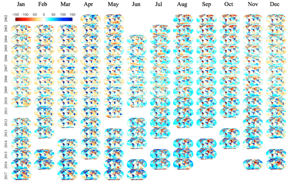

#################################################################
Level-3 Data Products 
#################################################################

5.1 Known Uncertainties & Sources of Error 
==============================================

5.1.1. Level-2 Data Processing Errors
~~~~~~~~~~~~~~~~~~~~~~~~~~~~~~~~~~~~~~

All Level-3 GRACE and GRACE-FO data have errors and uncertainties inherited from the satellite-level measurements and Level-2 processing. The background gravity model used for Level-2 data processing contains errors of omission, as well as errors of commission. 

The collection of background models is used in GRACE and GRACE-FO Level-2 data processing to make a prediction of the observable range change or its derivatives. The difference between the observed and predicted values of the measurements is the residual, which exists because of the errors of omission and commission, in addition to the measurement errors and model deficiencies or incompleteness. The background gravity model errors may be expected to have continual spatial-temporal variability. An update to the background gravity model is computed such that the measurement residuals are minimized in the least-squares sense – and this update may be regarded as the new gravity information available from GRACE and GRCE-FO. In the science data processing, at the most elementary level, this update to the geopotential is parametrized, for a selected data span, as a set of constant corrections to the spherical harmonic coefficients of the geopotential, to a specified maximum degree and order. 

5.1.2 Correlated Error, Spatial Smoothing and Leakage Error
~~~~~~~~~~~~~~~~~~~~~~~~~~~~~~~~~~~~~~~~~~~~~~~~~~~~~~~~~~~~~~

The uncertainty of gridded Level-3 surface mass change products is a function of both measurement errors as well as signal leakage errors (Landerer and Swenson, 2012). Measurement errors include systematic and random errors, which are reduced by applying the de-correlation and Gaussian smoothing filters, respectively. 

While destriping and smoothing filters are typically successful in removing the correlated error, they have also been shown to remove real geophysical signals from the data which mimic the North-South striping pattern of the error. To compensate for this, a global set of gain factors (limited to continental hydrology applications) has been developed (Landerer and Swenson, 2012) to restore signal amplitudes which were removed in the filtering process. However, these gain factors can potentially introduce biases in frequency bands outside the annual component, in particular for longer term trends. In those cases, kernel-specific gain factors are necessary (Landerer and Swenson, 2012; Rodell et al., 2009). 

5.1.3 Glacial Isostatic Adjustment
~~~~~~~~~~~~~~~~~~~~~~~~~~~~~~~~~~~~~

GIA is not actually an error in GRACE and GRACE-FO data; in fact, GIA is a signal of great scientific interest in itself, as GRACE observations have provided new and more accurate estimates of GIA models, and have led to refinements of ice-load histories. However, the GIA corrections add some uncertainty for estimated surface mass trends over the GRACE period; a canonical uncertainty range of up to 20 percent is often assumed for GIA models.  

5.1.4 Earthquakes
~~~~~~~~~~~~~~~~~~~

Large earthquakes can cause sufficient displacements of the Earth's lithosphere to generate a change in Earth's gravity field that GRACE measures. Some examples include the earthquakes off the West Coast of Northern Sumatra (Indonesia) on December 24, 2004; Northern Sumatra on March 25, 2005; Southern Sumatra on September 12, 2007; offshore Maule, Chile on February 27, 2010; and near the East Coast of Honshu, off Tohoku, Japan on March 11, 2011. All the earthquakes mentioned above had magnitudes of 8.5 or higher.

As with GIA, earthquake-related changes in gravity would bias the derived 'equivalent water thickness' if not properly accounted for. While a GIA model is used to 'correct' the GRACE and GRACE-FO data, signals from large earthquakes are currently not removed from the GRACE and GRACE-FO data. Users should therefore be wary of signals in the vicinity of large earthquakes. A user can remove the signal due to an earthquake following the approach of de Linage et al. (2009); see their equation 3.

5.1.5 Atmosphere and Ocean De-aliasing Models
~~~~~~~~~~~~~~~~~~~~~~~~~~~~~~~~~~~~~~~~~~~~~~~~

The removal of atmospheric effects in GRACE-FO data takes advantage of the output of numerical weather modelling and forecasting analysis groups around the world, including the National Centers for Environmental Prediction (NCEP, United States) and the European Center for Medium Range Weather Forecasting (ECMW). These groups assimilate in situ observations, including barometers, and produce pressure maps every 6 hours. Analysis of the quality of these pressure fields by Velicogna and Wahr (1999) indicate that they are generally of sufficient quality to remove pressure effects at the level of less than 1 mbar (or even 0.5 mbar or less for 30 day averages) in most regions. 
 
Errors in de-aliasing models related to model drifts and changes can introduce biases GRACE estimates of mass change within basins. For instance, Hardy et al., (2017) show that over Antarctica, errors in AOD1B Release 05 (RL05) spuriously mask acceleration in mass loss on the order of 4 Gt yr-2. Over Greenland, atmospheric errors are a major noise source and introduce a spurious trend of up to 2 Gt yr-1. The released AOD1B RL06 mitigates some of these errors using a higher spatial resolution, more accurate input models, and better control of model-change biases.

5.1.6 Ocean Bottom Pressure
~~~~~~~~~~~~~~~~~~~~~~~~~~~~~

The uncertainty of the GRACE and GRACE-FO-derived ocean bottom pressure (OBP) values can be estimated with a variety of methods. For OBP values derived from Release-04 (RL04) GRACE coefficients, uncertainty has been estimated to be between 2 and 3 cm root-mean-square (RMS) depending on the type of processing, based on comparison to steric-corrected altimetry (Chambers, 2006; Chambers and Willis, 2010), output from an ocean model (Ponte et al., 2007; Quinn and Ponte, 2010), or bottom pressure recorders (Morison et al., 2007; Park et al., 2008). 

Chambers & Bonin (2012) conduct a validation of RL05 GRACE-derived OBP estimates and focus attention on the deep ocean because (1) OBP variations are longer wavelength and more resolvable by GRACE, and (2) quantifying accurate statistics for the deeper ocean areas avoids biases from higher errors near the coast.

To conduct the OBP validation, Chambers & Bonin (2012) use a general ocean circulation model that is a version of the MIT general circulation model (Marshall et al., 1997) and is run at JPL as part of the Estimating the Circulation and Climate of the Ocean (ECCO) consortium. The version of JPL ECCO used in the study is a baroclinic model forced by winds, pressure, and heat and freshwater fluxes from the National Center for Environmental Prediction (NCEP) operational analyzes products and also assimilates satellite altimetry.

Chambers & Bonin (2012) subtracted JPL ECCO OBP maps (unsmoothed) from the destriped and 300 km smoothed GRACE OBP maps and computed the standard deviation of the residuals. Results indicate that the standard deviation of residuals is generally less than 2 cm throughout the ocean, and often less than 1.5 cm (a significant improvement from RL04 residuals, where the standard deviation is generally greater than 2 cm, and often more than 3 cm). The standard error for GRACE-derived OBP was about 1 cm equivalent water thickness (EWT) in the low- and midlatitudes, and between 1.5 and 2 cm in the polar and subpolar oceans.

5.1.7 Terrestrial Water Storage
~~~~~~~~~~~~~~~~~~~~~~~~~~~~~~~~~~

Estimates of terrestrial water storage (TWS) variations suffer from signal degradation due to measurement errors and noise, which are manifested as both random errors that increase as a function of spherical harmonic spectral degree (Wahr et al., 2006), and systematic errors that are correlated within a particular spectral order (Swenson and Wahr, 2006). Landerer & Swenson (2012) use simulations of terrestrial water storage variations from land‐hydrology models to infer relationships between regional time series representing different spatial scales. These relationships, which are independent of the actual GRACE data, are used to extrapolate the GRACE TWS estimates from their effective spatial resolution (length scales of a few hundred kilometers) to finer spatial scales (∼100 km). Three scaling relationships are examined: a single gain factor based on regionally averaged time series, spatially distributed (i.e., gridded) gain factors based on time series at each grid point, and gridded‐gain factors estimated as a function of temporal frequency. While regional gain factors have typically been used in previously published studies, Landerer & Swenson (2012) find that comparable accuracies can be obtained from scaled time series based on gridded gain factors. In regions where different temporal modes of TWS variability have significantly different spatial scales, gain factors based on the first two methods may reduce the accuracy of the scaled time series. In these cases, gain factors estimated separately as a function of frequency may be necessary to achieve accurate results. The study provides gridded fields of leakage and GRACE measurement errors that allow users to estimate the associated regional TWS uncertainties. The resulting measurement errors typically showed a latitudinal dependence, with highest values near the equator (standard deviation of up to 35 mm), and decreasing towards the poles (standard deviation of 15 mm). 

5.1.8 Mascon Uncertainty 
~~~~~~~~~~~~~~~~~~~~~~~~~~~~~

Mascon uncertainty estimates are provided on a 0.5 degree grid in latitude and longitude. Note that the uncertainties provided are uncertainties associated with each mascon estimate, represented on this (oversampled) grid. For 3-degree mascons, there are 4,551 independent estimates of uncertainty represented on this grid. This is not the uncertainty associated with a single 0.5 degree pixel, which would be much higher. 

To derive the uncertainty estimates, the formal covariance matrix over the ocean is scaled to match the error seen when comparing the GRACE data to in-situ ocean bottom pressure data. Over quiet areas in the ocean, this amounts to approximately 1 cm of uncertainty per mascon. 

Over land, the formal uncertainty is scaled by 2, and roughly matches uncertainty estimates derived using methods described in Wahr et al., (2006). The provided estimates of uncertainty are regarded to be conservative. Since we implement a Kalman filter in the solution process to link adjacent months together temporally, monthly solutions both at the very beginning and end of the time series have slightly larger uncertainties than monthly solutions in the middle of the time series. A more detailed description is found in Wiese et al. (2016). 

5.3.9 Months with Lower Accuracy
~~~~~~~~~~~~~~~~~~~~~~~~~~~~~~~~~~~

Users need to be aware that the monthly grids have higher errors when the orbit is near exact repeat, which leads to degraded gravity field estimates. Such months include July to December 2004, and Jan & Feb 2015. Another source of larger errors is a gap of data (several hours to several days) in a few months.

Towards the end of the GRACE data record, several months contain accelerometer measurements from only a single satellite; for those months, special ‘ACC transplant’ solutions have been computed, which show degraded data quality with higher noise. These months are 11/2016, 12/2016, 01/2017, 03/2017, 04/2017, 06/2017.

5.3.10 Data Gaps in GRACE starting in 2011
~~~~~~~~~~~~~~~~~~~~~~~~~~~~~~~~~~~~~~~~~~~~~

Active battery management started in 2011 due to the aging batteries on the GRACE satellites. During certain orbit periods over several consecutive weeks, no ranging data were collected and hence no gravity fields could be computed. These gaps occur approximately every 5-6 months, and last for 4-5 weeks (Figure 3).

Figure 3. This plot shows data gaps in GRACE; active battery management started in 2011 due to the aging batteries on the GRACE satellites and led to periodic, recurring gaps every 5-6 months. 

5.2 Mascon vs. Spherical Harmonics Comparison: Which Should I Use?
====================================================================
In general, users are encouraged to use the current gridded mascon data for several main reasons:

#. Unlike the unconstrained spherical harmonic solutions, the constrained mascon solutions derived from geophysical models do not need to be destriped or smoothed and suffer less from leakage errors than harmonic solutions. For instance, Ocean bottom pressure (OBP) time series derived from the mascon solutions reduce the Root Mean Square error with respect to in situ data: Watkins et al. (2015) show a reduction of 0.37 cm globally, and as much as 1 cm regionally.
#. The mascon approach allows a better separation of land and ocean signals with the coastline resolution improvement (CRI) filter coupled with the application of state of the art gain factors.
#. Computing basin averages for hydrology applications shows general agreement between harmonic and mascon solutions for large basins; however, mascon solutions typically have greater resolution for smaller spatial regions, in particular when studying secular signals. 
#. The data processed from the spherical harmonic Level-2 data are not directly suited to accurately quantify ice mass changes over Greenland or Antarctica, or glaciers and ice caps. These regions require region-specific averaging kernels, as well as proper treatment of signal contamination from nearby land hydrology and adjusted GIA effects (see Jacob et al., 2012 for a thorough discussion of these aspects).

A caveat of the mascons is that it is not straightforward to quantify potential signal biases that could occur due to the addition of the a priori information. Watkins et al. (2015) note, however, that it is also difficult to quantify the exact amount of signal suppression that occurs when applying empirical post processing algorithms to remove correlated errors in the spherical harmonic gravity solutions. Derived gain factors are merely a good proxy for this and have considerable spatial variability.   
Although improvements can be made in the details of the implementation of the mascon solutions, such as including deterministic geophysical processes (such as trends and annual signals) as state parameters and using smaller mascons to more accurately define coastlines and spatial constraints, the introduction of credible statistical geophysical information—either from models or from independent observations—to condition the gravity solution is ultimately preferable to relying on empirical ad hoc post processing techniques to remove correlated errors.
