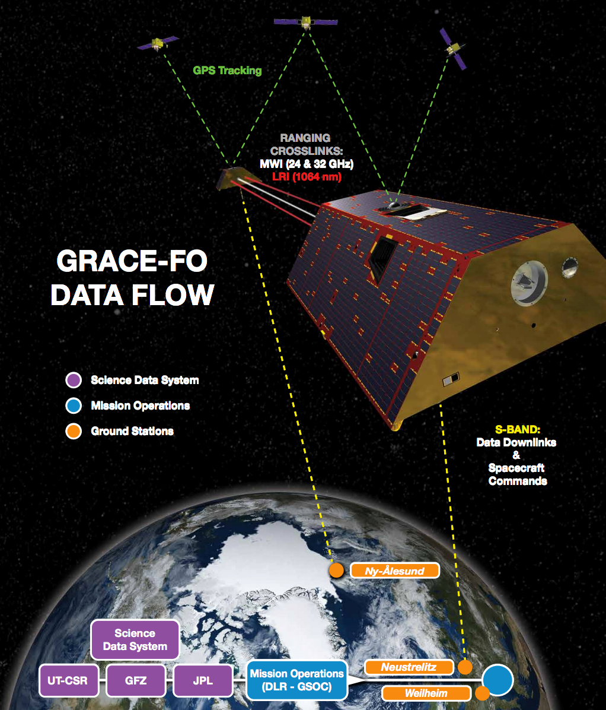
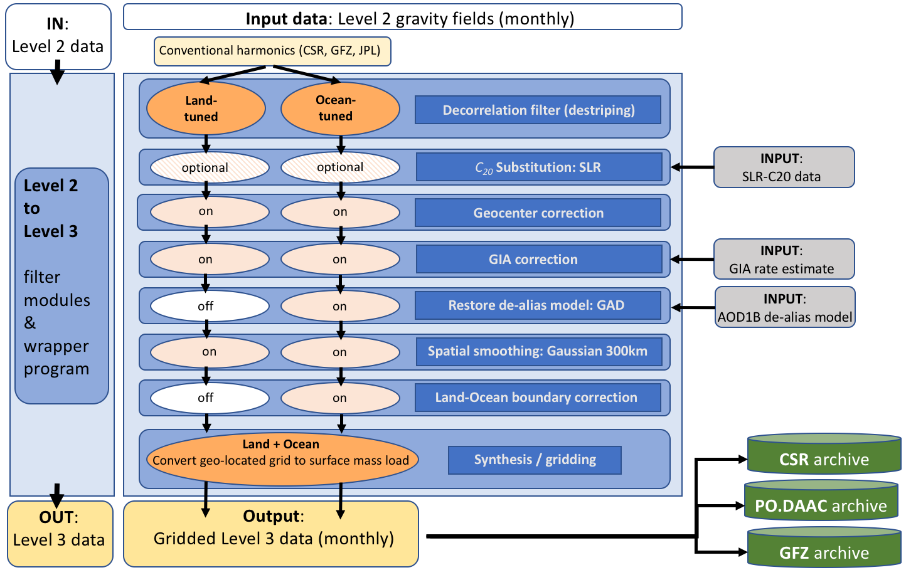

#################################################################
3. GRACE-FO Science Data Processing System
#################################################################

Since GRACE's launch in March 2002, the official GRACE Science Data System (SDS)
continuously releases monthly gravity solutions from three different processing centers.
GRACE-FO data will also be distributed in these processing centers (links to each can be found
in Section 7.1):

1.  Jet Propulsion Laboratory (JPL)
2.  Center for Space Research at University of Texas, Austin (CSR)
3.  GeoforschungsZentrum Potsdam (GFZ)

Deriving month-to-month gravity field variations from GRACE and GRACE-FO observations
requires a complex inversion of relative ranging observations between the two spacecraft, in
combination with precise orbit determination via GPS and various corrections for spacecraft
accelerations not related to gravity changes (Figure 1). GRACE and GRACE-FO data appear in
three different processing centers because many parameter choices and solution strategies that
are possible. GFZ, CSR, and JPL explore these solution strategies differently. The differences in
the resulting Level-2 gravity fields have helped to better understand the characteristics of the
various approaches, and differences between the centers’ processing strategies have generally
decreased over the Releases.
The varied solutions from JPL, CSR, and GFZ can be used to infer the uncertainty in Level-2
and Level-3 GRACE and GRACE-FO fields that arises from the choice of solution strategy.
Recent papers (e.g., Sakumura et al., 2014) found that the ensemble mean (simple arithmetic
mean of JPL, CSR, GFZ fields) was effective in reducing the noise in the gravity field solutions
within the available scatter of the solutions. We recommend that users average all three data
center's solutions (JPL, CSR, GFZ).

Figure 1. This graphic shows the GRACE and GRACE-FO Mission Science Data System and Flow. Data travel from the GRACE and GRACE-FO satellites to receivers on the ground. The measurement and housekeeping data are stored onboard the GRACE-FO satellites and relayed to ground stations when the satellites pass over at least once a day.

3.1 Level-1 Processing
=======================

Collectively, the processing from Level-0 to Level-1B is called the Level-1 Processing. Please
refer to the GRACE and GRACE-FO Level-1B Data Product User Handbooks for more
information on Level-1 processing.

3.2 Level-2 Processing
=======================

GRACE and GRACE-FO Level-2 gravity field data products contain a set of spherical harmonic
coefficients of the “geopotential”. “Geopotential” refers to the exterior potential gravity field of
the Earth system, which includes its entire solid and fluid (including oceans and atmosphere)
components. The geopotential at a fixed location is variable in time due to mass movement and
exchange between the Earth system components. The continuum of variations of the geopotential is represented by theoretically continuous variation of the geopotential coefficients. Following
conventional methods (Heiskanen & Moritz 1967), at a field point that is exterior to the Earth
system, the potential of gravitational attraction between a unit mass and the Earth system may be
represented using an infinite spherical harmonic series. Though the exact spherical harmonic
expansion of the geopotential requires an infinite series of harmonics, the expansion is
effectively limited to a maximum degree (approx. 60-100 for GRACE and GRACE-FO monthly
fields, and >150 for long-term mean fields). Degree 60 corresponds to spatial length scales of
about 330 km.
Three centers are part of the GRACE Ground System and generate the spherical harmonic fields
for the Level-2 data product: CSR, GFZ and JPL. Their output includes spherical harmonic
coefficients of the gravity field, as well as the dealiasing fields used in the data processing. For a
detailed description of the Earth gravity field estimates provided by the Level-2 processing and
the background gravity models used, please refer to the Level-2 Gravity Field Product User
Handbooks for each center.

3.3 Level-3 Processing
=======================

3.3.1 Overview
~~~~~~~~~~~~~~~~~

Observed monthly changes in gravity are caused by monthly changes in mass. Most of the monthly gravity changes are caused by changes in water storage in hydrologic reservoirs, by moving ocean, atmospheric and land ice masses, and by mass exchanges between these Earth system compartments. As such, gravity measurements from space provide a precise measure of mass redistribution of Earth’s water cycle. Their vertical extent is measured in equivalent water height (also known as equivalent water thickness). 
The transformation of the gravity potential into Earth surface mass changes requires the application of various steps to account for a number of different processes including the removal of correlated and random errors, glacial isostatic adjustment (GIA), as well as other background model corrections. 

The land and ocean grids (also known as mass concentration blocks or simply, “mascons”) are typically processed with domain-optimized filters that are tuned to best filter out noise while preserving real geophysical signals. The key processing steps from Level-2 spherical harmonic data to Level-3 gridded mascon solutions are summarized in Figure 2. 

Figure 2. Flowchart and overview of GRACE and GRACE-FO Level-3 sequential processing steps for conventional Level-2 spherical harmonic solutions. The land and ocean grids are processed with different filters that are tuned to best filter out noise while preserving real geophysical signals.    

3.3.2 Decorrelation filter (de-striping) 
~~~~~~~~~~~~~~~~~~~~~~~~~~~~~~~~~~~~~~~~~

Unconstrained monthly GRACE and GRACE-FO Level-2 solutions contain errors that arise from both random measurement errors as well as from correlated noise. The presence of correlated error in GRACE and GRACE-FO data manifests itself mostly as North-South stripes due to a lack in observability in the plane orthogonal to the satellites’ orbit. Several filters, most of which are empirical, exist to remove this correlated error (e.g., Duan et al., 2009; Chambers and Bonin, 2012). The filter used in Level-3 GRACE and GRACE-FO data processing to remove correlated error uses a destriping technique, based on approach described by Swenson and Wahr (2006), but adapted to more recent data releases. 

3.3.3 Spherical Harmonic Coefficient C2,0 Substitution
~~~~~~~~~~~~~~~~~~~~~~~~~~~~~~~~~~~~~~~~~~~~~~~~~~~~~~~~~

In contrast to degree-one coefficients, higher-order degrees (degree≥2) are directly observed by GRACE and GRACE-FO. However, it has been noted that some long-wavelength, low-degree geoid field coefficients from GRACE and GRACE-FO can be noisy. In particular, the spherical harmonic coefficient C20 (degree 2 and order 0) from GRACE and GRACE-FO Level-2 monthly solutions contains errors. Satellite-Laser-Ranging (SLR), on the other hand, currently provides more accurate measurements of the monthly variations of the C20 coefficient (Cheng et al., 2013). Therefore, C20 coefficients are replaced with the solutions from SLR (Cheng et al., 2011), which are processed with GRACE and GRACE-FO compatible background models. For more information on C20 substitution with SLR and J2, see the technical note TN-11_C20_SLR, which contains the Level-2 gravity field-compatible C20 coefficients and links to relevant documentation (https://podaac.jpl.nasa.gov/gravity/gracefo-documentation/).

3.3.4 Geocenter correction  
~~~~~~~~~~~~~~~~~~~~~~~~~~~~~~

The GRACE and GRACE-FO satellites measure gravity changes in the Earth’s center of mass (CM) reference frame. By definition, the combined solid Earth and all surface mass changes yield spherical harmonic degree-one (referred to as geocenter) Stokes coefficients equal to zero relative to the center of mass, and GRACE and GRACE-FO measurements alone cannot recover the degree-one coefficients directly. However, the omission of spherical harmonic degree-one coefficients can introduce significant biases in particular for seasonal surface mass variations as well as bias trends that arise when evaluating mass transport in the center of figure (i.e., relative to the solid Earth).

Because of their physical meaning, time changes in degree 1 coefficients can be expressed in several equivalent forms:

1.	As distances in mm between the center of mass and the center of figure along the Z (axis of rotation), X and Y axes;
2.	As fully normalized coefficients of the geopotential;
3.	As the changes in mass (per unit area) that would give rise to the geopotential coefficients, expressed either in kg/m2 or equivalent water height.

GRACE and GRACE-FO cannot retrieve spherical harmonic coefficients of degree 1 proportional to the position of the Earth's geocenter relative to an Earth-fixed reference frame. GRACE and GRACE-FO Level-3 processing uses an estimate of these coefficients based on Swenson et al. (2008), a method that uses both higher order gravity estimates and the forward-modeled geocenter contributions assuming the ocean contribution is known (e,g., from a model). GRACE and GRACE-FO geocenter coefficients computed in this manner are available at https://podaac.jpl.nasa.gov/gravity/gracefo-documentation/. These coefficients are expressed in the form (2) above.

3.3.5 Glacial Isostatic Adjustment
~~~~~~~~~~~~~~~~~~~~~~~~~~~~~~~~~~~~~

Some changes in gravity are caused by mass redistribution in the 'solid' Earth, including those due to glacial isostatic adjustment (GIA) of the lithosphere and mantle, which occur due to lithospheric viscous adjustment from the glacial loading of the last ice age. In those cases, the interpretation of the gravity changes in terms of equivalent water thickness are not correct. The standard Level-3 GRACE-Tellus mass grids have had a GIA model of secular trends removed, in terms of (apparent) mass change. Note that different GIA models exist and are frequently updated.

3.3.6 Land and Ocean De-aliasing Models
~~~~~~~~~~~~~~~~~~~~~~~~~~~~~~~~~~~~~~~~~~

High frequency variations in the Earth's gravity field caused by both the atmosphere and the ocean at sub-monthly (hourly to few days and weeks) periods would alias into the monthly gravity data due to insufficient sampling, and thus need to be corrected. The process of removing these high frequency variations with models is known as “de-aliasing.”

The mass of the atmosphere is removed during Level-2 processing using atmospheric pressure fields from the Integrated Forecasting System (IFS / ECMWF). As a result, the GRACE Tellus surface mass grids do not contain atmospheric mass variability over land or continental ice areas like Greenland and Antarctica except for errors in ECMWF. 

To avoid spatial and temporal aliasing of sub-monthly ocean mass changes (including tides), ocean mass changes are also forward-modeled and removed during the Level-2 GRACE processing. The ocean model removes high frequency (six-hourly to sub-monthly) wind and pressure-driven ocean motions that might otherwise alias into the monthly gravity solutions. The resulting monthly GRACE/GRACE-FO gravity fields effectively represent corrections to the ocean model. To use the data over the oceans, the GRACE Tellus ocean bottom pressure fields include the monthly averaged ocean model grids added back to the gravity coefficients (for more information, see Chambers and Bonin, 2012).

Details on the dealiasing GRACE and GRACE-FO AOD1B products as well as on the precursor releases can be found in the GRACE AOD1B Product Description Document (Fletchner et al., 2015).

3.3.7 Spatial smoothing
~~~~~~~~~~~~~~~~~~~~~~~~~~

While a significant amount of correlated errors can be removed with the de-correlation filter, an additional filter step is often employed to reduce remaining noise. This reduction can be achieved by applying a spatial smoothing filter. A simple isotropic Gaussian filter can be formulated in the spherical harmonic domain as (e.g., Chambers 2006). The smoothing radius is 300 km for land grids, and 500km for ocean grids. 

3.3.8 Spatial Leakage Correction
~~~~~~~~~~~~~~~~~~~~~~~~~~~~~~~~~~

Due to the limited spatial resolution of GRACE and GRACE-FO, the signal separation along land-ocean boundaries is also limited. Large signals that actually occur over land can ‘leak’ into the adjacent ocean areas and give the false appearance of large ocean bottom pressure changes while in reality these signals actually occur over land (e.g., Chambers and Bonin, 2012). An iterative solution to compute the ‘leaked’ signals and improve the land-ocean signal separation was first proposed by Wahr et al., (1998), and has since been improved and fine-tuned by Chambers and Bonin (2012).
