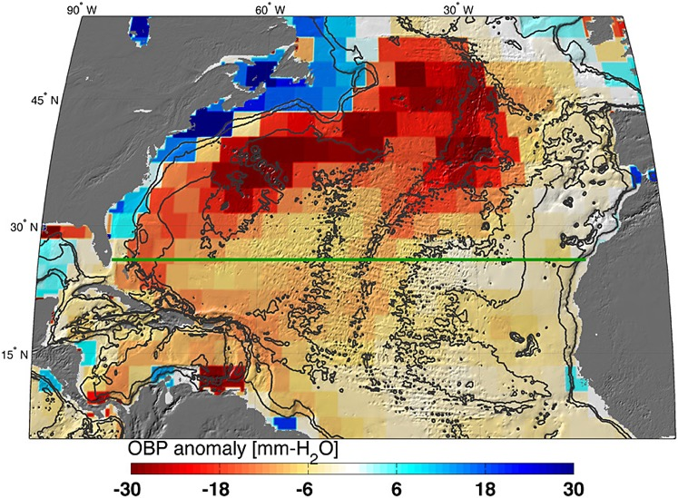

#################################################################
7. Level-3 Data Access, User Guidelines, and use cases 
#################################################################

7.1 Data Description
======================================================
Table 2 summarizes key information about GRACE-FO data, including information on the satellites’ orbit as well as Level-3 data spatial resolution, temporal resolution and latency. GRACE level-3 data products are delivered in several data formats to accommodate a range of user needs. The formats are: netcdf, ascii, geotiff (land only). 

Each monthly GRACE Tellus grid represents the surface mass deviation for that month relative to a baseline temporal average (most often 2004-2009). For comparisons against other data or models, it is critical that anomalies relative to the same time-average are compared. This is simple to do: for example, if the new baseline is 2004-2006, average the data over 1/2004 to 12/2006 for all grid points, and subtract this average grid from all other monthly grids. Please check the Frequently Asked Questions section of the GRACE Tellus website regarding other questions about the time-mean field (see https://grace.jpl.nasa.gov/about/faq/). 

The mascon data are provided with a spatial sampling of 0.5 degrees in both latitude and longitude (approx. 56 km at the equator). This differs from the spherical harmonic solutions, which are provided with a spatial sampling of 1 degree in latitude and longitude. The reason for the difference is that the mascons have boundaries that lie on Parallels of approx. 0.5 degree increments. Although the grid is sampled at 0.5 degree resolution, it does not mean that two neighboring cells are ‘independent’ of each other. In fact, the native resolution is the size of a single mascon, which is 3 degrees (equal area) in size. The most accurate interpretation of the JPL mascon data would be obtained by summing over entire mascons using the mascon placement file (https://podaac.jpl.nasa.gov/dataset/TELLUS_GRAC-GRFO_MASCON_CRI_GRID_RL06.3_V4). 

The units of the data and error grids are Liquid_Water_Equivalent_Thickness (in centimeter); gain factors (scale factors) are dimensionless and time-invariant. 

The grids have 720 longitude points (0.25, 0.75, 1.25, ..., 359.75), and 360 latitude points (-89.75, -89.25, ..., 89.25, 89.75). 

Presently, we provide GRACE-Tellus data from the most recent GRACE gravity fields: Release 06 from CSR, JPL and GFZ. The Level-2 spherical harmonics are used as inputs to Level-3 post-processing steps. The spatial sampling of all grids is 1 degree in both latitude and longitude (approx. 111 km at the equator). However, this does not mean that two neighboring grid cells are 'independent' because (1) the actual spatial resolution of GRACE and GRACE-FO is about 330 km (Table 2), and (2) because spatial smoothing has been applied. A more detailed description of the data processing, gain factor derivation and caveats is available in Landerer and Swenson (2012).

  .. list-table:: Table 2: Overview of Level-3 relevant GRACE instrument and science measurement characteristics & constants used in this document. 
   :widths: 25 25
   :header-rows: 0

   * - **Orbit** 
     - 
   * - Type
     - Near-polar (inclination 89°)
   * - Altitude
     - Approx. 356 km (as of Jun 2015)
   * - In-orbit distance between GRACE 1 & 2
     - Approx. 200 km
   * - **Spatial Resolution**
     - 
   * - Resolution on the ground
     - Approx. 330 km
   * - **Temporal Resolution**
     - 
   * - Gravity field (Standard)
     - Monthly intervals
   * - Gravity field (QuickLook)
     - Daily updates (over moving window covering previous 10-30 days)
   * - **Data Collection**
     - 
   * - Latency (standard)
     - 1-2 months
   * - Latency (QuickLook)
     - 3-5 days

The following filename convention is used:

GRCTellus.[Center].[Start]_[End].[Realm].[Release].[version]
with the following options for the [placeholders]:

[Center]	JPL, CSR, or GFZ

[Start]		first month of record (yyyymm; e.g., 200204)

[End]		last month of record (yyyymm; e.g., 201204)

[Realm]	LND (for land); OCN (for ocean)

[Release]	GRACE data release (e.g., RL06)

[version]	ID to identify Level-3 processing version 

In addition to the file header and name, details about the processing steps and parameters are documented in a change-log / README file for each Level-3 data product. See the Metadata File in Appendix A for a full description of each item in GRACE-FO Level-3 metadata. 

7.2 Data Access 
==================
After validation, all Level-3, Level-2 and accompanying Level-1B products are released to the public through two portals. One is the Physical Oceanography Distributed Active Archive Center (PO.DAAC) at the Jet Propulsion Laboratory, Pasadena, USA, an element of the Earth Observing System Data and Information System (EOSDIS), developed by NASA.  The other is the Information System and Data Center (ISDC) at GeoForschungsZentrum (GFZ) Potsdam in Germany. 

As described above, the Level-3 processing is slightly different for land and ocean regions, and therefore these grids are published separately through the JPL/NASA PO.DAAC:

Ocean data: 	https://podaac.jpl.nasa.gov/dataset/TELLUS_GRFO_L3_JPL_RL06.3_OCN_v04 

Land data:	https://podaac.jpl.nasa.gov/dataset/TELLUS_GRFO_L3_JPL_RL06.3_LND_v04

The monthly estimates are also distributed through ISDC at the **GeoForschungsZentrum Potsdam (GFZ)**.

7.3 User Guidelines at a Glance
======================================

1). **Interpreting Terrestrial Water Storage Anomaly:** We assume that changes in the time-varying gravity field represent the movement of water mass over land, though this assumption should always be validated with ground data if possible. Other signals, such as tectonics, can also influence the GRACE and GRACE-FO measurements. GRACE and GRACE-FO data represent the time varying gravity field, not the static gravity field, and as such they have no mean-value by definition. In other words, GRACE and GRACE-FO data only represent anomalies with respect to the mean state (i.e. water storage anomaly) and cannot provide information about the total (absolute) amount of water stored at a location. For consistent comparisons against other data or models, the temporal mean of each dataset should be computed over a common time period and subtracted from the respective time series (as mentioned in section 7.1). 

2). **Native Spatial resolution:** GRACE and GRACE-FO mass change fields can typically resolve spatial scales down to approximately 330 km. This number can vary slightly with the version being used and the smoothing that is applied during post-processing. However, the spatial sampling of the Level-3 data is often higher, with grids typically provided on a one degree (~110 km) or half-degree sampling (~55 km). Thus, users should always keep in mind that data across neighboring grid points is highly correlated and essentially a resampling of the same observation. For study areas smaller than approximately 100,000 km2, the signal to noise ratio may be poor, and errors (especially from spatial smoothing and signal leakage, see sections 3.3.7 and 3.3.8) should be carefully assessed.

3). **Non-uniform Temporal Sampling:** the GRACE and GRACE-FO gravity fields are solved for those time periods when enough orbits exist to create a global gravity field solution. This constraint can lead to non-uniform temporal discretization of the data products when outages and breaks occur. Be careful in comparing to other data sets that the GRACE and GRACE-FO data products may not always align with calendar months, and may not be uniformly spaced in time. 

4). **Error and uncertainty evaluation:** Error estimates are presented with the GRACE and GRACE-FO data products. Errors from two primary sources are calculated for spherical harmonic solutions: measurement and leakage errors. These errors should be considered, and care should be taken that these errors can be spatially correlated for regional averaging (e.g., for a river basin). Procedures and pseudo-code for averaging spatially-correlated errors are presented on the GRACE Tellus website. 

5). **Available Data products:** The GRACE and GRACE-FO “mascons” (e.g. RL06M) represent the state-of-the-art in the processing of the GRACE and GRACE-FO observations to minimize signal damping and leakage errors (compared to spherical harmonic solutions). These should be used when possible, as they generally have the best signal-to-noise ratio, and lower uncertainties (see Watkins et al., 2015 or Scanlon et al., 2016  for an evaluation). For the mascon product, a coastal resolution improvement (CRI) filter is applied to coastal mascons to reduce land signal leakage from ocean mascons. For most hydrology, cryospheric, and oceanographic applications, the CRI corrected data should be used. 

6). **Gain-factors:** Model-derived gain factors (also called scale factors) are provided with the data. These can be used to enhance the spatial resolution of the GRACE observations (to 0.5 degrees for mascons, and to 1 degree for harmonic-based grids). These gain factors are derived by applying GRACE processing to model estimates of terrestrial water storage and subsequently estimating the gain factor necessary to restore the amplitude of the original model estimates. Because these gain factors rely on spatial information provided by a land surface or hydrological model, caution should be used in their interpretation as these models might have biases and typically do not include groundwater or human activities in their simulations. GRACE and GRACE-FO data for groundwater studies or studies of human impacts on hydrology may require additional, customized gain factors. The appropriate use and limitations of gain factors is discussed further in Landerer and Swenson (2012) and Long et al . (2015).
If each grid node is g(x,y,t) where x is longitude index, y is latitude index, t is time index, and the gain factor is s(x,y), then the gain-corrected time series is simply

.. math ::

  g'(x,y,t) = g(x,y,t) * s(x,y)

7.4 Data Use Cases
==================================
The following use cases provide simple and easy to follow examples of how to use GRACE and GRACE-FO Level-3 data. They are designed to be accessible to new and beginner users to facilitate proper analysis and interpretation. This section is a summary of those use cases, and the step-by-step instructions are presented later in Appendices A, B, C and D.

7.4.1 Water Storage Anomalies Over the Colorado River Basin
~~~~~~~~~~~~~~~~~~~~~~~~~~~~~~~~~~~~~~~~~~~~~~~~~~~~~~~~~~~~~

**Goal:** Produce a time series and map of liquid water equivalent thickness anomalies in the Colorado (CO) River Basin. 

**Approach:** In order to get to know GRACE Level-3 data before doing any data processing, we will first explore the data with an online interactive data plotter. Then, we will download the data and conduct the necessary pre-processing to produce a time series of Terrestrial Water Storage anomalies of the CO Basin and a map for the example time period of June, 2016.

**Summary of Steps (also see Appendix A):**
1.	Explore GRACE Level-3 Terrestrial Water Storage anomalies of the CO Basin using the interactive online data plotter
2.	Download Level-3 gridded Terrestrial Water Storage anomalies mascons 
3.	Pre-processing: multiply mascon data by gain factors
4.	Create a map and time series graph of the water storage anomalies in the CO River Basin
Note that although this example aims to determine water storage anomalies, GRACE anomalies can easily be converted to rates. For example, if GRACE observed an anomaly of 20 cm over a given study area in April and an anomaly of 10 cm in March, then the water storage change (i.e. monthly rate) would be 10 cm/mo.

**Sample Products**

.. figure:: ../figures/fig4_colorado_river_basin_map.png
    :align: center
    :alt: alternate text
    :figclass: align-center

7.4.2 Groundwater Storage in the Sacramento / San Joaquin River Basin
~~~~~~~~~~~~~~~~~~~~~~~~~~~~~~~~~~~~~~~~~~~~~~~~~~~~~~~~~~~~~~~~~~~~~~~~~~

**Goal:** Produce a time series of the Sacramento-San Joaquin river basin in California that shows groundwater storage anomalies from 2004 through 2015.  

**Approach:** The basic approach to deriving groundwater anomaly estimates involves subtracting monthly anomalies of hydrologic water storage components, including soil moisture, snow water equivalent and reservoir storage, from GRACE Terrestrial Water Storage anomalies. The remaining changes in Terrestrial Water Storage can then be interpreted to result from changes in groundwater storage. However, users need to be aware that by subtracting other observations or model estimates, the remaining signal then also accumulates errors and uncertainties of those quantities as well. The approach taken here is similar to Famiglietti et al. (2011). 

**Summary of Steps (also see Appendix B):**
1.	Download the data:
  
  a). GRACE Level-3 gridded Mascon Terrestrial Water Storage anomalies data.
  
  b). Snow Water Equivalent from the SNOw Data Assimilation System (SNODAS)
  
  c). Soil Moisture from the Global Land Data Assimilation System (GLDAS) 

  d). Reservoir storage from the California Data Exchange Center (CDEC) 

  e). Sacramento / San Joaquin River Basin boundary from Interactive Database of the World’s River Basins

2.	Pre-processing:

  a). Pre-process reservoir storage anomaly data.

  b). Convert all units to cm.

  c). Multiply GRACE mascon data by gridded gain factors.

  d). Produce anomalies for all variables of interest using the same time period as baseline as with GRACE data (Jan. 2004 – Dec. 2009).

3.	Produce groundwater estimate by subtracting soil moisture, snow water equivalent, and reservoir anomalies from GRACE mascons TWS anomalies. 

4.	Plot the time series plot of the groundwater storage anomalies in the basin.

**Sample Products**

7.4.3 Ocean Mass & Sea Level Budget
~~~~~~~~~~~~~~~~~~~~~~~~~~~~~~~~~~~~~~~~~

**Goal:** There are two main objectives for this example. The first is to derive global ocean mass anomalies from GRACE mascon ocean bottom pressure (OBP) data. The second objective involves determining anomalies in the global sea level budget and estimate the change in ocean volume caused by thermal expansion.

**Approach:** The approach to derive global ocean mass anomalies involves removing the effects of atmospheric pressure from bottom pressure, and then adjusting for the difference of ocean density versus freshwater density. The resulting ocean mass anomalies are then subtracted from the sea surface height anomalies from altimetry measurements in order to assess ocean height changes caused by thermal expansion. Methods used in this use case follow those described by Llovel et al. (2015). 

**Summary of Steps (also see Appendix C):**

1.	Download the data:
  
  a).  Level-3 gridded Mascon Water Storage anomalies data from GRACE Tellus website
  
  b). Ocean mask from GRACE Tellus website

  c). GAD product from Atmosphere and Ocean Dealiasing Level-1B (AOD1B). GAD represents the bottom pressure simulated by Ocean Model for Circulation and Tides (OMCT), forced by atmospheric energy and momentum fluxes (e.g., wind stress). In this application, only the global ocean mean of GAD is required.

  d). Global GIA-corrected Sea Level-time series. 

2.	Convert GRACE ocean bottom pressure (OBP) mascons to ocean mass anomalies:
  
  a).  Apply ocean mask to isolate the ocean in GRACE mascons 
  
  b).  Remove effect of atmospheric pressure by subtracting the GAD background model from GRACE mascons
  
  c).  Obtain ocean mass anomalies by adjusting for the difference in ocean density versus freshwater density (a small correction)

3.	Use a sea level budget approach to estimate thermal expansion
  
  a). Subtract sea surface height from ocean mass anomalies. 
  
  b). Produce a graph and time series decomposition of the component of ocean height change attributed to thermal expansion.

**Sample Products**

.. figure:: ../figures/fig7_global_sea_level_plot.png
    :align: center
    :alt: alternate text
    :figclass: align-center

7.4.4 Ocean Currents & Transport
~~~~~~~~~~~~~~~~~~~~~~~~~~~~~~~~~~~~~

**Goal:** The goal of this use case is to summarize the steps taken by Landerer et al. (2015), who present the first measurements of changes in the meridional transport of large‐scale Atlantic Meridional Overturning Circulation (AMOC) flows using Ocean Bottom Pressure (OBP) estimates derived from GRACE. 

**Approach:** The methodology involves using the zonal OBP differences at the basin boundaries of the Atlantic to obtain information on AMOC variations. As the large-scale flows are dominated by a geostrophic balance, the meridional transport per unit depth at a particular latitude and depth can be derived from the zonal bottom pressure differences and at the eastern and western basin boundaries. Methods for this use case are described in detail by Landerer et al. (2015).

**Summary of Steps (also see Appendix D):**

1.	Download the data:
  
  a).	Level-3 gridded Mascon Terrestrial Water Storage anomalies data from PODAAC website
	
  b). Ocean mask available in same file
	

2. Use GRACE ocean bottom pressure (OBP) mascons to characterize AMOC variations.

a).	Derive the meridional transport T(y,z)  at a particular latitude (y) and depth (z) by dividing the zonal bottom pressure differences P_E  (y,z) and P_W  (y,z) at the eastern and western basin boundaries by the Coriolis parameter (f) and the mean sea water density (ρ_0):

.. math::
    T(y,z)=  (P_E (y,z)- P_W (y,z))/(ρ_0 f)
  

b). Integrating this between depth levels z1 and z2 yields the layer geostrophic AMOC volume transport from ocean bottom pressure data across the ocean basin:

.. math::
    T(y)=  1/(ρ_0 f) \int_{z1}^{z2} P_E (y,z) - P_W (y,z) \, dz

**Sample Products**

Figure from Landerer et al. (2015). The map shows ocean bottom pressure anomalies (mean of November 2009 through March 2010, relative to 2005–2012 mean) over the North Atlantic basin. Also shown is the location of the hydrographic in situ RAPID MOCHA section (green line; Marotzke et al., 2002). Bottom pressure signals are largest on the western side of the basin and tend to be anticorrelated between shallow (0–1000 m) and deeper ocean regions (1000–5000 m) (see also Figure 1). One mm‐H2O OBP corresponds to approximately 10 Pa.

Figure from Landerer et al. (2015). The graph shows meridional transport estimates from GRACE OBP anomalies on the eastern and western margin integrated over the 3000–5000 m depth layer at 26.5N, compared to the RAPID‐MOCHA estimate of LNADW. The RMS difference between these two estimates is 1.2 sverdrup and the correlation is R = 0.69. The 1 sigma error of the GRACE‐LNADW estimate is ±1.1 sverdrup.